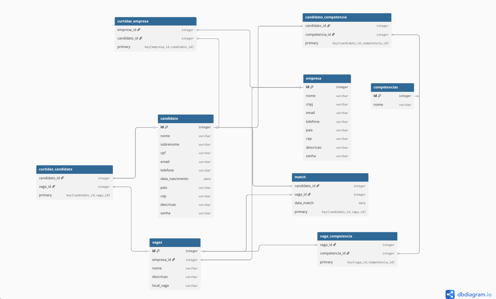

# Linketinder
# 💘🧑‍💼 Linketinder
Autor: Nathan Teixeira de Oliveira

> Sistema de recrutamento inspirado no LinkedIn + Tinder.
> MVP desenvolvido em Groovy para simular conexões entre candidatos e empresas através de competências (skills).

---

## 📌 Sobre o Projeto

O *Linketinder* é uma aplicação com o objetivo de tornar o processo de recrutamento mais prático, justo e eficiente.

A proposta é combinar:

- 🔹 O sistema de *match* do Tinder
- 🔹 O campo de *competências (skills)* do LinkedIn
- 🔹 A relação direta entre candidato e empresa

O sistema surge como alternativa às soluções tradicionais, que muitas vezes retornam dados tendenciosos e favorecem perfis mais populares ao invés de perfis com real potencial técnico.

Este projeto representa um *MVP (Minimum Viable Product)* da solução.

---

## 🎯 Objetivo do MVP

Criar uma aplicação simples em terminal que:

- Armazene candidatos e empresas
- Permita visualizar os dados cadastrados
- Estruture competências para futuras funcionalidades de match

---

## 🚀 Tecnologias Utilizadas

- Groovy
- Java (JVM)
- Git
- GitHub

---

## 📋 Requisitos Implementados

### ✅ Requisitos Obrigatórios

- Array com no mínimo *5 candidatos pré-cadastrados*
- Cada candidato contém:
  - Nome
  - E-mail
  - CPF
  - Idade
  - Estado
  - CEP
  - Descrição pessoal
  - Array de competências (ex: Python, Java, Spring, Angular)

- Array com no mínimo *5 empresas pré-cadastradas*
- Cada empresa contém:
  - Nome
  - E-mail corporativo
  - CNPJ
  - País
  - Estado
  - CEP
  - Descrição da empresa
  - Array de competências esperadas

- Menu simples no terminal com opções para:
  - Listar candidatos
  - Listar empresas

---

### 🔶 Requisitos Opcionais (Possível Evolução)

- Cadastro de novos candidatos
- Cadastro de novas empresas
- Implementação futura de sistema de match

---

## 🏗 Estrutura do Projeto


## Estrutura do Projeto

```text
📁 Linketinder/
├── 📁 src/
│   ├── 📁 app/                   
│   │   └── Main.groovy
│   │
│   ├── 📁 model/                  
│   │   ├── Pessoa.groovy
│   │   ├── User.groovy
│   │   ├── Enterprise.groovy
│   │   ├── MatchCandidato.groovy
│   │   └── MatchEmpresa.groovy
│   │
│   └── 📁 service/                
│       ├── CadastroService.groovy
│       └── Menu.groovy
│
└── README.md
```
## 💻 Como Executar

1. Certifique-se de ter o **Groovy** instalado:  
   ```bash
   groovy --version
2. Navegue até a pasta do projeto
   cd Linketinder/src/app
3. Execute o programa
   groovy Main.groovy

  No projeto:

  aparecerá o terminal:

```text
1. Candidato - entrará na área de candidatos, onde aparecerão as empresas para dar match ou passar
2. Empresa - entrará na área de empresas, onde aparecerão os candidatos para dar match ou passar
3. Listar empresas - listará o NOME das empresas
4. Listar candidatos - listará o NOME dos candidatos
```

## 🧪 Teste únitario (TDD)

Os testes seguem o princípio de:

Testar comportamento, não implementação.

Ou seja, não testamos se foi usado << na lista,
mas sim se o sistema realmente passou a conter o novo elemento após o cadastro.


O que foi testado?

✔ Cadastro de novo candidato

✔ Cadastro de nova empresa

O teste valida que:

O tamanho da lista de usuários aumenta após o cadastro.

O novo usuário é realmente adicionado à lista.

O último elemento da lista corresponde ao usuário inserido.


## 🛠 Tecnologias utilizadas 

- ☕ Java 17

- 🐍 Groovy 3.x

- 🧪 JUnit 5

## Nova estrutura do projeto (com TDD)

```text
📁 Linketinder/
├── 📁 src/
│   ├── 📁 app/                  
│   │   └── Main.groovy
│   │
│   ├── 📁 model/                
│   │   ├── Pessoa.groovy
│   │   ├── User.groovy
│   │   ├── Enterprise.groovy
│   │   ├── MatchCandidato.groovy
│   │   └── MatchEmpresa.groovy
│   │
│   └── 📁 service/               
│       ├── CadastroService.groovy
│       └── Menu.groovy
│
├── 📁 test/                        
│   └── 📁 service/
│       └── CadastroServiceTest.groovy
│
└── README.md

```


## 🚀 Nova estrutura do projeto (com frontend)

```text
Linketinder/
│
├── frontend/
│   ├── index.html
│   ├── package.json
│   ├── package-lock.json
│   ├── tsconfig.json
│   ├── .gitignore
│   │
│   ├── node_modules/
│   │
│   ├── public/
│   │   ├── css/
│   │   │   └── style.css
│   │   │
│   │   └── pages/
│   │       ├── cad_candidato.html
│   │       ├── cad_empresa.html
│   │       ├── cad_vaga.html
│   │       ├── perfil_candidato.html
│   │       └── perfil_empresa.html
│   │
│   └── src/
│       ├── main.ts
│       │
│       ├── charts/
│       │   └── chart.ts
│       │
│       ├── controllers/
│       │   ├── candidatoController.ts
│       │   ├── empresaController.ts
│       │   ├── listagem.ts
│       │   └── vagaController.ts
│       │
│       ├── models/
│       │   ├── Candidato.ts
│       │   ├── Empresa.ts
│       │   ├── User.ts
│       │   └── Vaga.ts
│       │
│       └── services/
│           └── validador.ts
│
├── src/  # Backend (Groovy)
│   ├── app/
│   │   └── Main.groovy
│   │
│   ├── model/
│   │   ├── Enterprise.groovy
│   │   ├── MatchCandidato.groovy
│   │   ├── MatchEmpresa.groovy
│   │   ├── Pessoa.groovy
│   │   └── User.groovy
│   │
│   └── service/
│       ├── CadastroService.groovy
│       └── Menu.groovy
│
├── test/
│   └── service/
│       └── CadastroServiceTest.groovy
│
├── .gitignore
├── Linketinder.iml
└── README.md

```

## 🚀 Como Rodar o Projeto (parte frontend)

🌐 Frontend (Vite + TypeScript)

Certifique-se de ter o Node.js instalado em sua máquina.

Navegue até a pasta do frontend:

Bash:

cd frontend

Instale as dependências:

Bash: 

npm install
Inicie o servidor de desenvolvimento:

Bash
npm run dev

Após rodar o comando, o Vite informará uma URL (geralmente http://localhost:5173). 

Abra este endereço no seu navegador para visualizar o Linketinder.


## 🛠️ Tecnologias Utilizadas (Frontend)

- Vite: Build tool ultra-rápida para o desenvolvimento moderno.

- TypeScript: Tipagem estática para garantir maior segurança e menos erros no código JavaScript.

- HTML5 & CSS3: Estruturação e estilização da interface com foco em responsividade.

- Programação Orientada a Objetos (POO): Organização do código TypeScript utilizando classes, interfaces etc.


## 🎲 Modelagem de dados 

- Para modelagem de dados foi utilizado DBdiagram.io
- Exportado e alterado alguma sintaxes que o import trouxe errado




## 📑 Tabelas criadas 

- Dentro do diretório db tem um arquivo chamado linketinder_setup
- Lá se encontra as queries feitas na parte de SQL


## Aplicando S.O.L.I.D

Boas práticas e melhorias aplicadas

Durante o desenvolvimento do projeto, foram realizadas diversas melhorias estruturais e de qualidade de código, visando organização, legibilidade e manutenção:

# Padronização e legibilidade de código

- Renomeação de variáveis para nomes mais descritivos
- Padronização de idioma (mantendo consistência nos nomes)
- Uso de nomes semânticos (ex: listaCandidatos, buscarUser)
- Refatoração segura utilizando a IDE (IntelliJ), evitando inconsistências

Essas melhorias tornam o código mais claro e fácil de manter.

# Separação de responsabilidades (SRP)

- Separação da lógica de interface (Menu) da lógica de execução (MenuController)
- Delegação das regras de negócio para a camada de Service
- Isolamento do acesso ao banco na camada DAO

👉 Cada classe passou a ter uma única responsabilidade.

# Organização em camadas
- Estruturação do projeto em pacotes:
- model
- dao
- service
- controller
- Melhor divisão entre dados, lógica e controle

👉 Facilita manutenção e escalabilidade do sistema.

Uso de injeção de dependência (básico)
Passagem de dependências via construtor (ex: CadastroService no controller)
Redução de acoplamento entre classes

